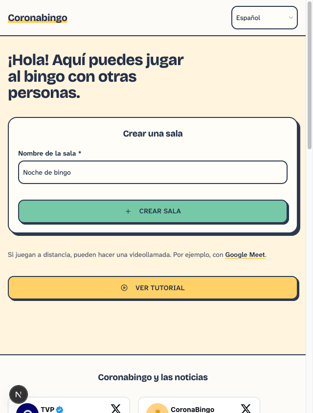
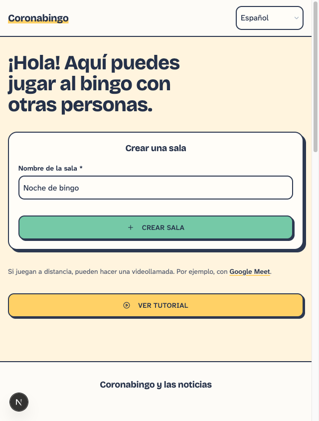
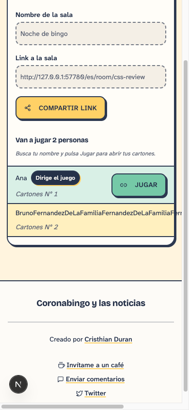
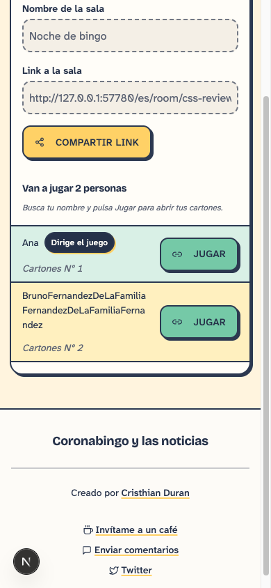
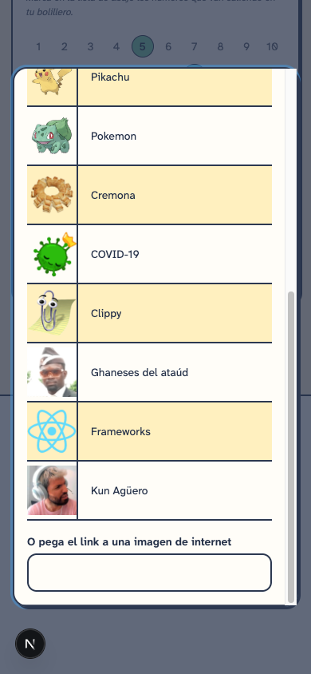
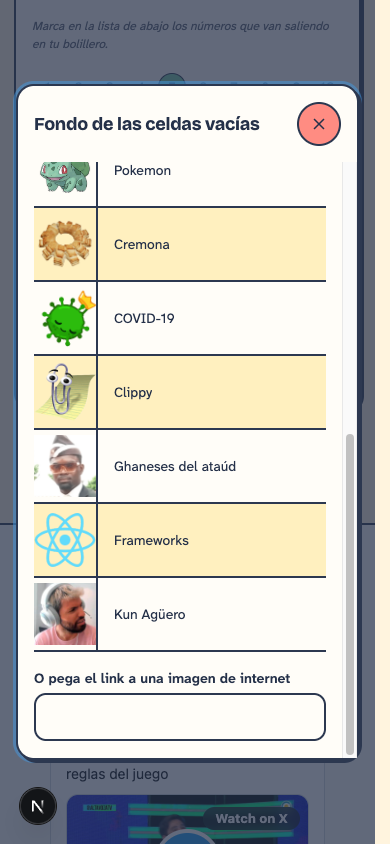
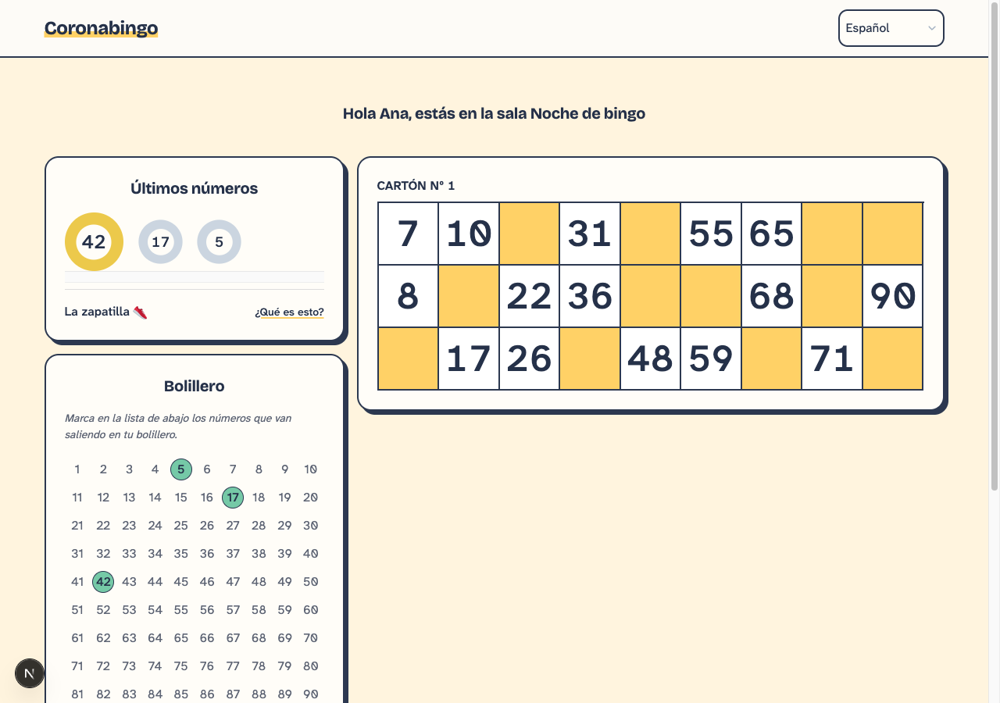
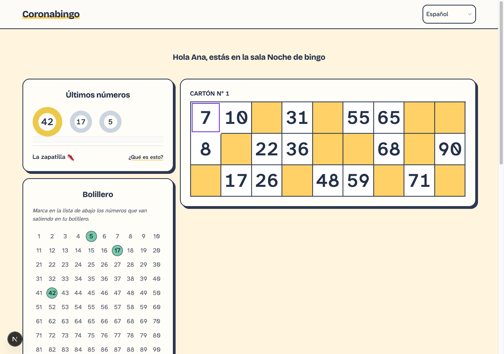

# CSS usability visual review

These screenshots compare base `8cccabd` with this change using the same local Firestore emulator fixtures and viewport for each pair. The room and players are test data. No Production game records were used. Click an image to inspect its original size.

## Homepage and form controls

At 640px wide, the old heading suddenly shrank to 32px. It now follows a continuous scale and measures about 40px. Input and select text is at least 16px, including below the desktop breakpoint. The room-name field contains the same draft text in both screenshots.

| Before, 640 × 844 | After, 640 × 844 |
| --- | --- |
|  |  |

## Long player names

The full name wraps inside the row, and the Play button stays inside the viewport. The same rules apply to the room setup list. Player and room names in game headings can also wrap.

| Before, 390 × 844 | After, 390 × 844 |
| --- | --- |
|  |  |

## Long dialogs

Both screenshots show the background picker scrolled to its final field. Previously, scrolling also removed the heading and close button from view. The new body scrolls independently, leaving the heading and 44px close button visible.

| Before, 390 × 844 | After, 390 × 844 |
| --- | --- |
|  |  |

## Card focus

The number 7 is the focus target in both screenshots. The new violet frame and white edge identify it without changing its marked state or the card geometry. Number-board cells use the same frame, and the number board keeps ten columns. See the [focus follow-up](focus.md) for comparisons against the first PR version across card themes and a marked mobile cell, including capture methodology.

| Before, 1280 × 900 | After, 1280 × 900 |
| --- | --- |
|  |  |

## Verification

- `npm run lint:check`, `npm run build`, and `git diff --check` passed.
- `npm run ui-tests:production` passed all 88 Chromium tests, including four new ES/EN usability tests.
- New checks cover 320–1280px widths, increasing text size, long names in setup/lobby/game headings, marked and unmarked keyboard focus, forced colors, modal focus restoration, and scrolling in portrait, landscape, and desktop layouts.
- Screenshots use the local development server. The compiled production build was tested separately with isolated host/player contexts and Firestore emulator data.
- Real iOS Safari focus zoom remains a manual device check. Older browsers without `dvh` retain the `vh` height fallback; browsers without `scrollbar-gutter` retain normal modal scrolling but may shift horizontally when the page scrollbar disappears.
