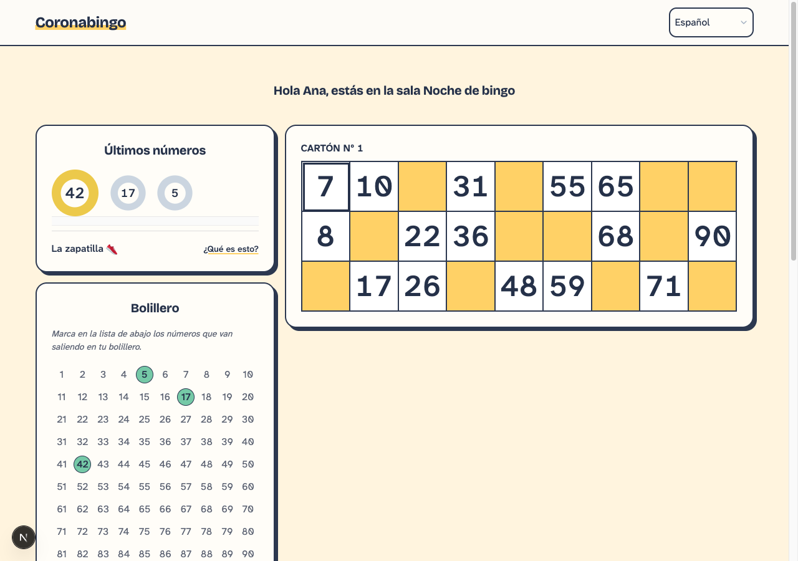
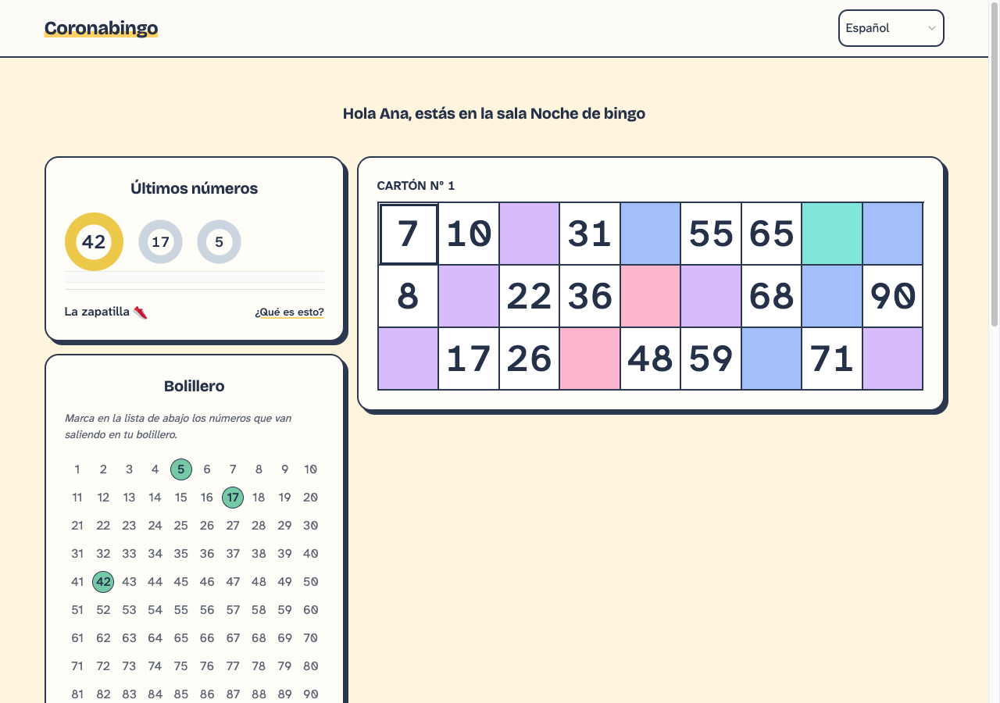
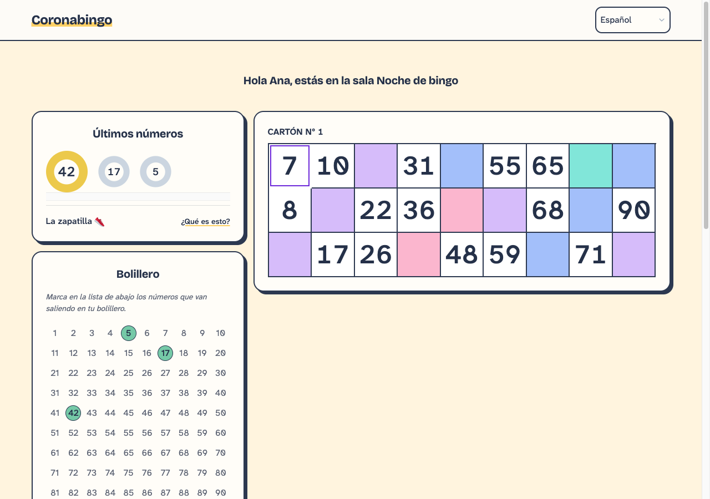
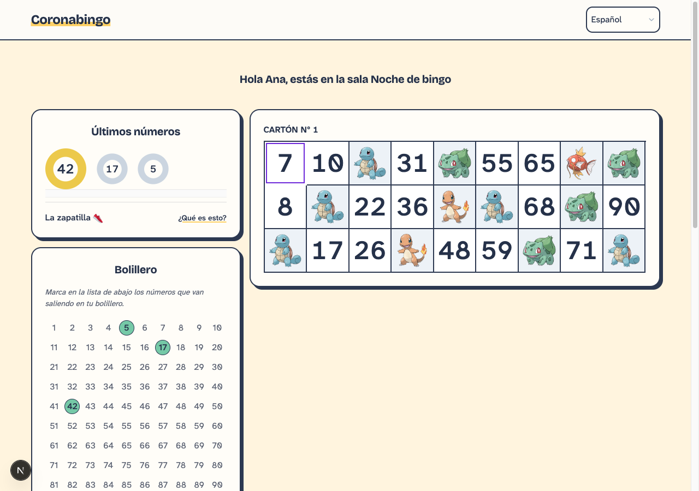
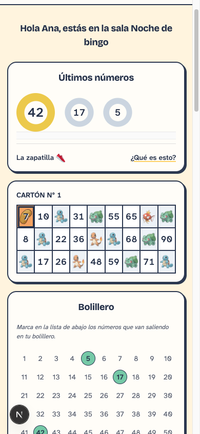
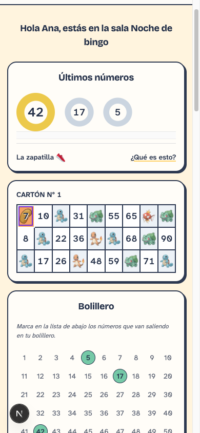

# Focus across card themes

The first PR version used the same dark color as the grid. The revised indicator pairs a saturated violet frame with a white outer edge. It stays inside the numbered cell, paints above the bean marker, and lets clicks through. Windows forced-colors mode uses the system Highlight outline instead.

The two colors have more than 7:1 contrast with each other. The white edge separates the violet from the dark grid and colored neighbors. This follows the [W3C two-color focus technique](https://www.w3.org/WAI/WCAG21/Techniques/css/C40). The background picker decorates empty cells; it does not place images behind the numbers.

| Theme | First PR version | Revised focus |
| --- | --- | --- |
| Plain, 1280 × 900 |  |  |
| Multicolor, 1280 × 900 |  |  |
| Images, 1280 × 900 |  |  |
| Marked number, 390 × 844 |  |  |

These are local emulator captures of the same room, card, and number 7. The collaborative browser did not retain foreground keyboard focus, so captures apply the actual focus declarations to the target through a temporary DOM selector. Before captures apply the declarations from commit `2596e52`; after captures use the revised stylesheet. This capture-only selector is not part of the application. The automated browser suite separately exercises real Tab navigation, marking, every catalog background and a custom image URL, both languages, narrow/desktop widths, and forced colors.
